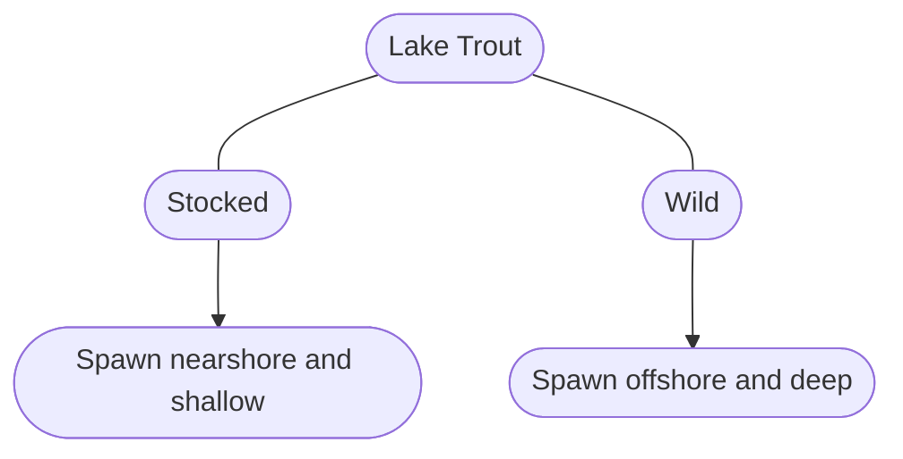

# Header Level 1: Homework #4

## Header Level 2: Unordered list

- Object 1
- Object 2
- Object 3

### Header Level 3: Ordered list

1. Object 1
2. Object 2
3. Object 3

#### Header Level 4: Manual line breaks

There are
manual line breaks
in this sentence.

##### Header Level 5: Link and image

[Personal Bio381 website](https://mfutia.github.io/FutiaBio381/)


###### Header Level 6: Text blocks

> this is written as a blockquote

``` this is plain code block```

R code block:

```{r}
# test
2+2
```

inline code: `2+2 = 4`

A simple in line LaTeX equation (wrap with single "\$") is $2+2=4$

The above equation centered (wrap with double "\$") is below:
$$
2+2=4
$$

---

==Simple table:==

| Lake trout origin | Spawning Location     |
| ----------------- | --------------------- |
| Hatchery          | Nearshore and shallow |
| Wild              | Offshore and deep     |

---

Flow chart:




